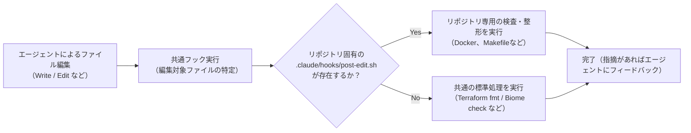

# Agent Plugins

Claude Code や OpenAI Codex などのAIコーディングツールで共通利用できる、開発用スキル（Skills）とフック（Hooks）を管理するリポジトリです。

同一の `SKILL.md` や実行スクリプトを共有し、複数ツール間での開発ワークフローの統一と自動化を実現します。

---

## 導入方法

各ツールのCLIからユーザー単位でプラグインを登録・インストールします。手動でこのリポジトリをcloneする必要はありません。

| ツール | インストール手順 |
|---|---|
| **Claude Code** | `claude plugin marketplace add shin4488/agent-plugins --scope user`<br>`claude plugin install agent-plugins@agent-plugins --scope user` |
| **Codex** | `codex plugin marketplace add shin4488/agent-plugins`<br>`codex plugin add agent-plugins@agent-plugins` |

- プラグインの登録はユーザー環境単位で行われます。
- インストール後はツールを再起動（リロード）して反映します。
- 動作環境として、ホストマシンに Bash、Git、jq、realpath が必要です。

---

## 提供スキル一覧

日常の開発サイクルで頻出するタスクをスキルとして提供しています。

| スキル | 主な役割 |
|---|---|
| **create-branch** | 基点ブランチを確認し、作業ブランチを作成 |
| **commit** | 変更内容を意味のある単位にまとめてコミット |
| **create-pr** | 変更内容と検証結果をまとめたプルリクエストを作成 |
| **verify-changes** | 変更の動作検証、機密情報の有無、ドキュメントの整合性を確認 |
| **post-merge** | マージ後の反映確認とブランチ整理 |
| **release** | リポジトリの規約に沿ったタグ打ち・リリースノート作成 |
| **pin-github-actions** | 外部GitHub Actionsの参照をcommit SHAに固定・検証 |
| **review-dependabot-prs** | 依存関係更新PRの変更内容・CI状態をチェックし、マージ可否を判断 |
| **fix-security-alerts** | GitHubの検出結果・解析警告を切り分け、既存スキルを使って対応PRを作成・解消状態を確認 |
| **spec-based-testing** | 仕様と振る舞いに基づくテストケースの設計 |
| **security-review** | 入力値・権限・通信などのセキュリティ観点でのレビュー・改善 |

---

## 編集後フック（post-edit）

ツールによるファイル編集後、自動的にコード整形や静的解析（lint）を実行するフックを提供しています。



### 標準処理の対象
- **Terraform (`.tf`)**: `terraform fmt` による自動整形、および必要に応じた `terraform validate`。
- **Web関連ファイル (`.ts`, `.tsx`, `.js`, `.jsx`, `.json`, `.css` など)**: プロジェクト内の設定に基づき `biome check --write` を実行。

### リポジトリ固有のカスタマイズ
リポジトリ内に `.claude/hooks/post-edit.sh` を配置することで、プロジェクト独自のビルドツール（Docker環境内でのテストや専用Linter）に処理を置き換えることができます。

---

## ディレクトリ構成

```text
agent-plugins/
├── .claude-plugin/       # Claude Code 向けプラグイン定義
├── .codex-plugin/        # Codex 向けプラグイン定義
├── skills/               # 各スキルの定義（SKILL.md）
└── hooks/                # フック設定と共通実行スクリプト
    ├── hooks.json
    └── scripts/
```

---

## プラグインの更新

```bash
# Claude Code
claude plugin marketplace update agent-plugins
claude plugin update agent-plugins@agent-plugins --scope user

# Codex
codex plugin marketplace upgrade agent-plugins
codex plugin add agent-plugins@agent-plugins
```
