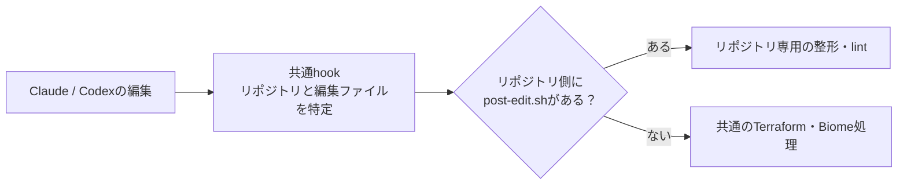

# Agent Plugins

Claude CodeとCodexで使う開発用skills・hooksを、一つのリポジトリで管理する。
両ツールが同じ `SKILL.md` とシェルスクリプトを使う。

## 導入

利用するリポジトリに導入手順があれば、そのREADMEに従う。ターゲット名やCLI未導入時の扱いは利用側で管理する。
手動で導入する場合は、使うツールのCLIで以下を実行する。この共通リポジトリを別途cloneする必要はない。

| ツール | 登録・インストール |
| --- | --- |
| Claude Code | `claude plugin marketplace add shin4488/agent-plugins --scope user` → `claude plugin install agent-plugins@agent-plugins --scope user` |
| Codex | `codex plugin marketplace add shin4488/agent-plugins` → `codex plugin add agent-plugins@agent-plugins` |

- 登録はユーザー単位。同じユーザーが別リポジトリから再実行しても、同じプラグインが重複して増えることはない。
- インストール後はツールを読み込み直す。CodexのhookはCLIの `/hooks` で定義を確認・承認する（[公式手順](https://learn.chatgpt.com/docs/hooks)）。インストールはhookの承認を兼ねない。
- 自分で信頼を確認したリポジトリで使う。共通hookはリポジトリ内のスクリプトや開発ツールを実行するため、プラグインへの信頼だけでリポジトリのコードまで安全と判断しない。
- ホストにはBash・Git・jq・realpathが必要。Terraform・Biome・Dockerなどは各リポジトリの環境構築手順で準備する。
- Claudeの `permissions` はCodexに引き継がれない。

## Skills

リポジトリの開発ガイドと既存コマンドを参照する。固定手順が必要な操作は順序を明記し、設計や調査は目的・判断基準・完了条件を示す。

| Skill | 担当すること |
| --- | --- |
| [create-branch](skills/create-branch/SKILL.md) | 基点を確認して作業ブランチを作る |
| [commit](skills/commit/SKILL.md) | 変更を意味のまとまりごとにコミットする |
| [create-pr](skills/create-pr/SKILL.md) | 変更と検証結果が伝わるPRを作成・更新する |
| [verify-changes](skills/verify-changes/SKILL.md) | 変更の検証、機密情報、関連ドキュメントを確認する |
| [post-merge](skills/post-merge/SKILL.md) | マージ後の反映を確認し、作業ブランチを整理する |
| [release](skills/release/SKILL.md) | リポジトリの規約に従って成果物・タグ・Releaseを準備・公開する |
| [pin-github-actions](skills/pin-github-actions/SKILL.md) | 外部Action参照をcommit SHAに固定・検証する |
| [review-dependabot-prs](skills/review-dependabot-prs/SKILL.md) | 依存更新の互換性・更新元・CIを調べ、マージ可否を判断する |
| [spec-based-testing](skills/spec-based-testing/SKILL.md) | 仕様と観測できる結果からテストを設計する |
| [security-review](skills/security-review/SKILL.md) | 関係する入力・権限・通信の安全性を確認・改善する |

Claudeでは `/agent-plugins:release` のように呼び出す。Codexではスキル一覧から選択するか、`release` skillを使うよう依頼する。同じ差分・条件で行った検証は各skillから再利用する。skillの導入で、コメント・マージ・公開などの実行権限が追加されるわけではない。

## 編集後のhooks



### 共通の標準処理

| 対象 | 処理 | 条件 |
| --- | --- | --- |
| `.tf` | 編集ファイルだけに `terraform fmt` | ファイルのディレクトリで起動し、リポジトリのバージョン指定を使う |
| `.tf` | `terraform validate -no-color` | 編集ファイルと同じディレクトリに `.terraform` がある場合、ディレクトリごとに1回 |
| `.ts`<br>`.tsx`<br>`.js`<br>`.jsx`<br>`.json`<br>`.jsonc`<br>`.css`<br>`.html` | `biome check --write` | ファイルの祖先にあるリポジトリ内の最上位の `biome.json` / `biome.jsonc` と、インストール済みのBiomeを使う |

- 編集したファイルだけを渡し、Biomeはプロジェクトごとにまとめて実行する。入れ子の設定や `extends` の解決はBiomeに任せ、同じファイルを二重処理しない。
- Biomeのルール・除外指定・バージョンはリポジトリ側のものを使う。ESLintだけのリポジトリなど、Biome設定のない場所には適用しない。除外設定で処理対象が0件になってもエラーにはしない。
- Biomeの `--write` は整形・安全なlint修正・import整理などを行う。`--unsafe` は付けない。
- 未導入ツールや未初期化のTerraformは、スキップした理由を出す。自動インストールや `terraform init` は行わない。
- Terraformの呼び出し元root moduleは推測しない。共有moduleの変更を特定の環境でvalidateする場合は、リポジトリ専用処理を使う。

### リポジトリ専用の処理

`.claude/hooks/post-edit.sh` をリポジトリに置くと、共通の標準処理を置き換える。Docker、独自のMakefile、特定環境のTerraformなどに使う。

| 受け渡し | 内容 |
| --- | --- |
| 作業ディレクトリ | Gitリポジトリのルート |
| 引数 | 編集済みファイルの絶対パス。1回の編集で複数ファイルなら、まとめて1回呼ぶ |
| 標準入力 | 元のイベントJSONは渡さない |
| 結果 | 標準出力・標準エラー・終了コードをそのまま引き継ぐ |

専用hookでは、引数のファイルに応じてリポジトリ既存の整形・検査コマンドを呼ぶ。リポジトリ全体を検査する場合は、ファイルごとに繰り返さず1回にまとめる。対象拡張子やコマンド名は利用側で管理する。

ファイルはGit管理し、各開発者のcloneに含める。共通処理も含めて実行不要なリポジトリでは、このファイルを `exit 0` だけにできる。リポジトリ外のスクリプトへのシンボリックリンクは呼ばない。

### 対象と制限

- `Write`・`Edit`・`MultiEdit`・`apply_patch` の編集後に同期実行する。シェルやMCPによる編集はこのhookの対象外。
- 削除済みファイルとリポジトリ外のパスは除外し、改名は移動先を処理する。
- 各リポジトリ内を作業ディレクトリとして使う。親の複数リポジトリ管理ディレクトリからの横断編集には対応しない。
- hookは編集を取り消さない。残る指摘はエージェントが確認・修正する。完全なテストや型検査の代わりにはならない。
- 既存リポジトリの編集後hook登録は、移行時にClaude・Codexの両方から外す。`Stop` や実行前ガードなど、別イベントの登録は残す。

## 構成

```text
agent-plugins/
├── README.md
├── .claude-plugin/
│   ├── marketplace.json       # 両ツール共通の配布一覧（取得先はリポジトリルート）
│   └── plugin.json            # Claude用の定義
├── .codex-plugin/
│   └── plugin.json            # Codex用の定義
├── skills/<skill名>/SKILL.md  # 両ツールが読む唯一の実体
└── hooks/
    ├── hooks.json            # 編集後イベントの登録
    └── scripts/
        ├── post-edit.sh      # リポジトリの特定と呼び出し
        ├── edited-files.sh   # 編集ファイルの抽出
        └── format-lint.sh    # Terraform・Biomeの標準処理
```

導入を自動化する場合は、[導入](#導入)の登録・インストールコマンドを利用側のセットアップに組み込む。プラグインの実体は利用側に複製しない。GitHubで管理する実体は一つで、インストール先キャッシュはツールごとに分かれる。個人名やメールは定義に書かず、公開済みのGitHubアカウント名を使う。

## 更新

両方の `plugin.json` のversionを同じ値で更新し、変更を公開する。利用者はcatalogとインストール済みプラグインを更新する。

```bash
claude plugin marketplace update agent-plugins
claude plugin update agent-plugins@agent-plugins --scope user

codex plugin marketplace upgrade agent-plugins
codex plugin add agent-plugins@agent-plugins
```

更新はそのユーザーの各リポジトリに適用される。読み込み直し、Codexでhookの再確認が表示された場合は `/hooks` で確認する。ローカルcloneの `git pull` や、導入コマンドの再実行だけで両ツールの更新が完了したとは扱わない。

## 仕様

- [Codexのプラグイン構成](https://developers.openai.com/plugins/build/plugins)
- [Codexのhooksと承認](https://learn.chatgpt.com/docs/hooks)
- [Claude Codeのプラグイン](https://code.claude.com/docs/en/plugins-reference)
- [Claude Codeのmarketplace](https://code.claude.com/docs/en/plugin-marketplaces)
- [Terraform fmt](https://developer.hashicorp.com/terraform/cli/commands/fmt)・[validate](https://developer.hashicorp.com/terraform/cli/commands/validate)
- [Biome CLI](https://biomejs.dev/reference/cli/)

共通marketplaceの `policy` はCodex向け。Claudeの検証では未知の項目として警告されるが、読み込み時は無視される。
